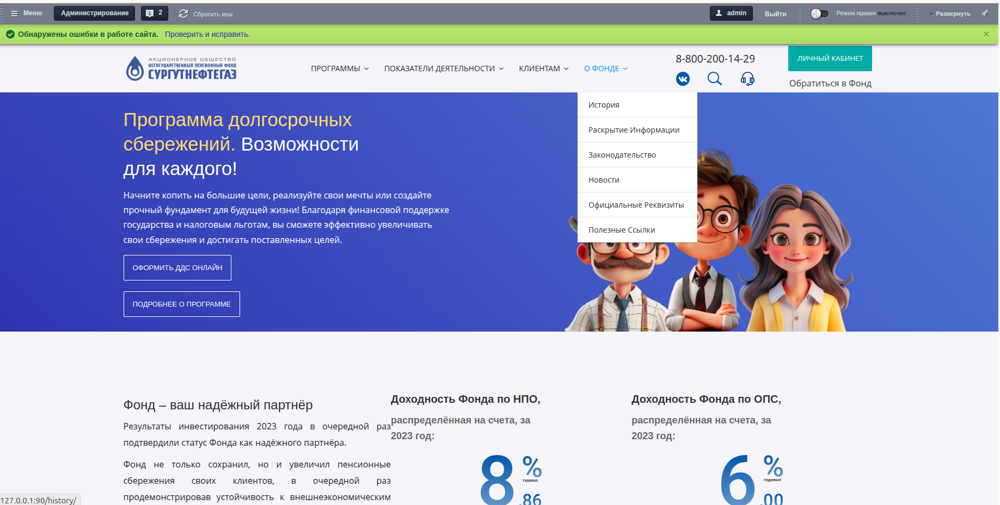
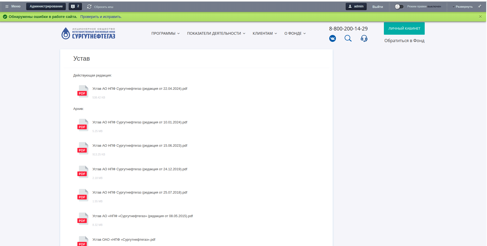

## Введение
Сайт АО «Негосударственный пенсионный фонд «Сургутнефтегаз» реализованный на 1С-Битрикс: Управления сайтом
 и докер. Используется nginx, php 8.1, mysql.

### Задание
- Сверстать шаблон сайта АО «НПФ «Сургутнефтегаз» (шапку, подвал) для 1С-Битрикс: Управления сайтом.
- Сверстать страницу как на странице localhost/allinfo/ustav/, файлы должны хранится в медиабиблиотеке Битрикса и подгружаться на страницу через компонент. Компонент должен автоматически определять расширение файла и подгружать нужную иконку.

## Требования
- Git
- Docker
- Docker Compose v2

## Установка
### Клонирование
```shell
git clone https://github.com/KorenevVyacheslav/npf
```

## Запуск и остановка bitrixdock
```shell
docker compose -p bitrixdock up -d
```
Чтобы проверить, что все сервисы запустились посмотрите список процессов `docker ps`.
Откройте в браузере адрес localhost:90.

### Остановка
```shell
docker compose -p bitrixdock stop
```

### Полное удаление
```shell
docker compose -p bitrixdock down
```
## Подключение к БД




